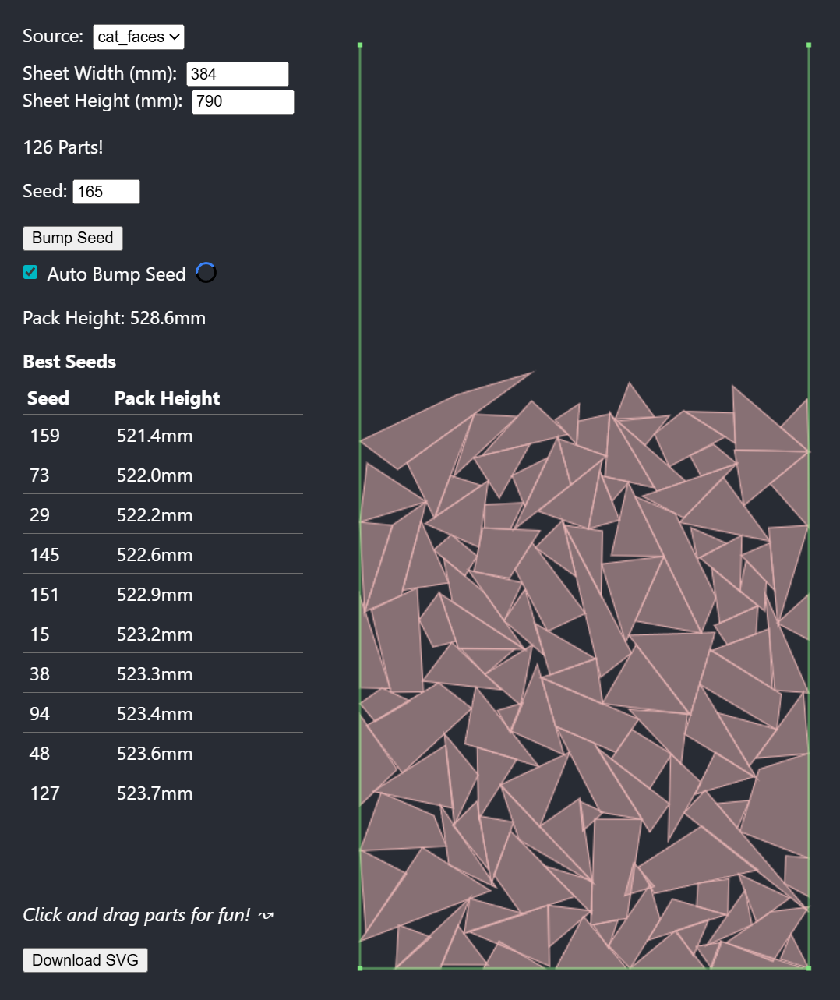

# Physics Bin Packing

This tool helps optimize polygonal part packing on a single 2D sheet using a physics simulation.

The [bin packing problem](https://en.wikipedia.org/wiki/Packing_problems) is a class of optimization problems that is computationally difficult ([NP-complete](https://en.wikipedia.org/wiki/NP-completeness)). Commercial and open-source applications, including CAD-package plugins, mostly use heuristic approximation algorithms. Using a physics engine is an interesting alternative to explore. This project uses a TypeScript port of the Box2D engine: [box2d.ts](https://github.com/lusito/box2d.ts).

[](https://caseprince.github.io/physics-bin-packing/)\
*View project live at [https://caseprince.github.io/physics-bin-packing/](https://caseprince.github.io/physics-bin-packing/).*

## Setup

Install Node.js version 22.20.0 (or a compatible LTS release). In the project directory, run:

### `npm install` && `npm run dev`

This starts the app in development mode using Vite.
Open the URL printed in the terminal (typically [http://localhost:5173](http://localhost:5173)).

The page will reload automatically when you make edits.

## Usage

- Initial part placement is random but deterministic based on a seed. By default, the app can automatically cycle through seeds and record those with the best packing density. There's not a huge amount of variation in overall density between seeds, but it's fun to watch!
- Input is an SVG file (currently hardcoded).
- Parts are defined as top-level `<g>` group nodes.
- Part geometry does not need to be purely polygonal. It can include curves, interior details, text, and so on.
- A simplified shape must be provided for the physics simulation. This is defined by an SVG group with class `hitboxes` that contains polygonal `<path>` or `<rect>` elements.
- Hitbox polygons should have seven or fewer control points.
- More complex or concave shapes can be achieved by combining multiple convex nodes within the `hitboxes` group.
- `hitboxes` groups will be excluded from the output. All other nodes and properties are retained. Parts will be positioned on the sheet with an added `transform` property, so input nodes should not already include this property.

### Example SVG Part Geometry


*Tool paths are shown in blue and green. Physics `hitboxes` are shown in red.*

### Simplified Example of Input & Output

Input:

```xml
<g fill="none" stroke="blue" stroke-width="0.3">
    <path d="M 26.48 -33.58 L 2.89 -86.60 Q 2.68 -87.08 2.17 -86.97 Q 1.67 -86.86 1.67 -86.35 L ..." />
    <g class="hitboxes">
        <path d="M 27.99 -30.79 L 1.42 -90.52 L 1.42 -2.55 L 27.99 -30.79" />
    </g>
</g>
```

Output:

```xml
<g fill="none" stroke="blue" stroke-width="0.3"
    transform="translate(409.72910872945386, 896.3707300965011) rotate(-89.99841816436704)">
    <path d="M 26.48 -33.58 L 2.89 -86.60 Q 2.68 -87.08 2.17 -86.97 Q 1.67 -86.86 1.67 -86.35 L ..." />
</g>
```

## Origin

This tool was developed as part of the workflow for a series of laser-cut sculptures, but could be used for any 2D CNC process.


